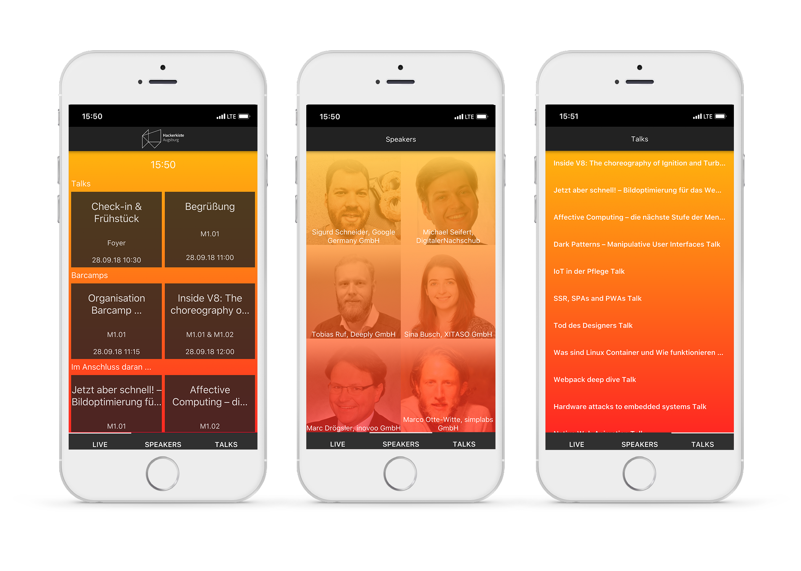

# Conntac - Hackerkiste 2018
Auch dieses Jahr war die [Hackerkiste 2018](https://2018.hackerkiste.de) wieder eine voller Erfolg! Mehr als 250 Besucher erfuhren über zwei Tage alles über die Themen: **Web**, **IT-Security** & **IoT**. Bei der Hackerkiste kommt jeder auf seine Kosten. Die Veranstaltung ist eine Mischung aus Konferenz, Barcamp und Hackathon. Veranstaltet wird das Event jährlich von: [Digitales Zentrum Schwaben (DZ.S)](https://schwaben.digital)

Auch Conntac war dieses Jahr natürlich wieder vertreten. Nachdem wir bereits im letzten Jahr mit dem [**Hackerkoffer**](https://github.com/Conntac/conntac-hackerkoffer) großen Anklang fanden, haben wir uns in diesem Jahr als Startup-Sponsor natürlich nicht nehmen lassen ein weiteres spannendes Hackathon Thema zu stellen.

## Unser Projekt beim Hackathon
Nach dem Motto **Cross-Platform-Entwicklung von 0 auf 100**, haben wir uns bei der diesjährigen Hackerkiste einiges vorgenommen. 

Unser Hackathon-Team aus interessierten Designern, Frontend- und Backendentwicklern erarbeitete in zwei Tagen einen Prototypen für eine Hackerkisten-App.

### Unser Vorgehen
**1. Konzeption der App**

Zuerst hat sich ein Team daran gemacht, den Funktionsumfang der App zu bestimmen und Mockups mit Adobe Illustrator erstellt. Auch das Navigationsschema wurde hier bereits berücksichtigt.

**2. Entwicklung eines Backends**

Parallel hat sich ein Team aus Entwicklern direkt an die Umsetzung der Datenbereitstellung gemacht und sämtliche Daten von der Webseite der Hackerkiste gecrawlt und für die App bereitgestellt. Der Crawler bietet im ersten Schritt eine `API` an, mit der der aktuelle Zeitplan, Talks und Speaker abgerufen werden können. Damit diese Daten der App auch offline zur Verfügung stehen, wurden die Antworten in `JSON-Dateien` gespeichert. Hierfür verwendeten sie `Python` mit [Flask](https://www.crummy.com/software/BeautifulSoup/bs4/doc/) und [Beautiful Soup](https://www.crummy.com/software/BeautifulSoup/bs4/doc/).

**3. Entwicklung eines Prototypen**

Mit Hilfe von des [Qt-Frameworks](https://www.qt.io/qt-for-application-development/) und [QtQuick](https://doc.qt.io/qt-5.11/qtquick-index.html) haben wir innerhalb von 3 Stunden einen Prototypen der App entwickelt. Die App läuft bereits jetzt auf allen mobilen Endgeräten und Desktop-Plattformen. Da es hier um Zeit ging, haben wir bisher auf die Implementierung von Logik in `C++` verzichtet.

**4. Präsentation**

Zum Abschluss des Events haben wir unseren Fortschritt präsentiert und die App auf einem `iPhone X` sowie einem Laptop mit `macOS` vorgestellt.

## Features der Hackerkisten-App

Was wir beim Hackathon geschafft haben:

* **Screen 1:** Homescreen mit aktuellem Zeitplan und Events
* **Screen 2:** Auflistung der Speaker mit Bild und Titel
* **Screen 3:** Aufführung der Talks mit Beschreibung bei Klick

Natürlich haben wir noch viele weitere Ideen, die nur darauf warten implementiert zu werden:

* Auswahl spezifischer Events durch Doppelklick
* Überführung dieser in einen individuellen Eventplan
* Benachrichtigung bei bevorstehendem Event
* Die Navigation zum Ort der Veranstaltung
* Ampel-Anzeige - Gibt Auskunft darüber, wie gut ein Event besucht sein wird
* Hintergrundinformationen über die Sponsoren, Veranstalter, etc.

## Mach mit!
Gerne kannst du dich an dem Projekt beteiligen. Wir freuen uns über neue Ideen und motivierte Programmierer. Wer weiß, vielleicht ist ja schon im nächsten Jahr die Hackerkisten-App produktiv im Einsatz. 💪

## So setzt du das Projekt auf

### Abhängigkeiten

* [Qt 5.8 oder neuer](http://download.qt.io/official_releases/online_installers/)
* Für iOS: Mac mit XCode 9 oder neuer
* Für Android: Android SDK sowie das NDK (am besten in Version 10e) und du musst im [QtCreator](https://www.qt.io/qt-features-libraries-apis-tools-and-ide/) die passenden Verzeichnisse hierzu unter "Einstellungen -> Geräte -> Android" konfigurieren.

### Starten
1. Die Datei `app/app.pro` mit dem QtCreator öffnen
2. Zielplattform wählen und den `Play button` drücken

## Schlusswort

Wir freuen uns auf die nächste Hackerkiste!
Nochmal Danke an das tolle Team! :+1:

